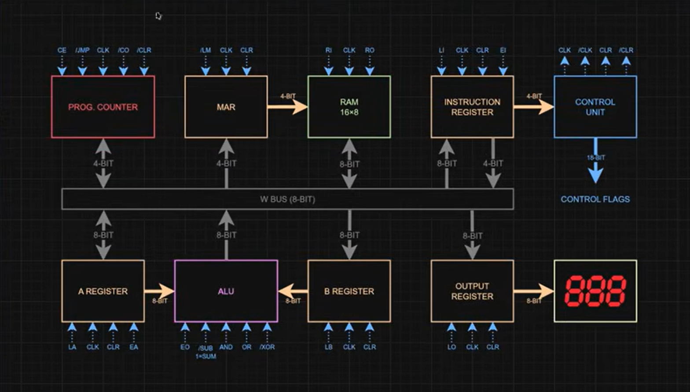

# SAP-1 (SIMPLE AS A POSSIBLE) COMPUTER 

   

1 - Programa Armazenado (strong-program)
  
  No SAP-1, todas as instruções (opecodes) quanto os dados (operandos) residem
  na RAM de 16 bits, sem distribuição física entre eles.

2 - barramento único para dados e instruções.

  O barramento de dados (W Bus) é compartilhado para trafegar a instruções buscando na RAM e,
  no ciclo seguinte, o dado a ser processado. Isso reproduz fielmente o famoso "Gargalo de Von      Neumann" (a contenção no barramento), onde a CPU fica limitada pela velocidade de transferência   entre a memória e o processador.

3 - Ciclo Busca-Decodifica-Executa (Fetch-Decode-Execute)

  A unidade de controle do SAP-1 é síncrona e sequencial. Primeiro, ela ativa o fetch, estágio em   que busca a instruções da RAM, no endereço designado pelo contador de programa, e a envia para    o registrador de instruções, depois decodifica o opcode e,  por fim, executa a instrução.

 4 - Componentes de Arquitetura clássicos

   O SAP-1 contém todos os blocos essenciais previstos no modelo.

   - Unidade de controle, que gerencia sinais de controle.
   - ULA, para executar operações lógicas e aritméticas.
   - Memória principal volátil (RAM).
   - Registradores, que funcionam como a memória interna da CPU.

 5 - Endereçamento Sequencial

  O contador de programa (PC) é oncrementado a cada instrução, rarantindo a execução línear de listas de commandos na memória -- salvo na ocorrência de saltos (jumps), que não existe no SAP-1 original.

 6 - Barramento de Palavra (W-Bus)

  O W-Bus (de Word Bus, Barramento de palavras) é um barramento de dados de 8 bits que interliga todos os componenetes do computador. È a via única por onde trafegam instruç~eos e dados entre a mémóri RAM, os registradores e a ULA (ou ALU). 

 
 
 7 - Contador de Programa (PC)

  No SAP-1, o Contador de PRograma (Programa Counter ou PC) é um contadoor sincrono de 4 bits (tipicamente implementado com um CI 74LS161) que retém o endereçp da próxima instrução armazenada na RAM (endereço de 0 a 15).
  O incremento da contagem só acontece sob comando explicito de Unidade de Controle, garantindo o sincronismo do ciclo de busca e execuçaõ de isntruções.  

  

  
